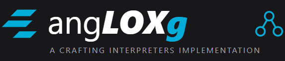

Un intérprete del lenguaje Lox escrito puramente en Go, desarrollado como "Trabajo Práctico" para la materia "Lenguajes y compiladores I ((TB027))" de la Universidad de Buenos Aires (FIUBA).

Esta implementación sigue los conceptos y la arquitectura del libro *Crafting Interpreters* de Robert Nystrom.

**Enlaces Rápidos**
* [📖 Documentación oficial](https://FelipeAscencio.github.io/angLOXg/)
* [▶️ Playground web interactivo](https://FelipeAscencio.github.io/angLOXg/web/)

**Ejecución y Testeo Local**

Para mantener la raíz del repositorio limpia, todas las instrucciones detalladas sobre cómo clonar, compilar, ejecutar y correr los tests locales se encuentran junto al punto de entrada del programa.

👉 **[Ver instrucciones de uso local en cmd/angLOXg/README.md](cmd/angLOXg/README.md)**
